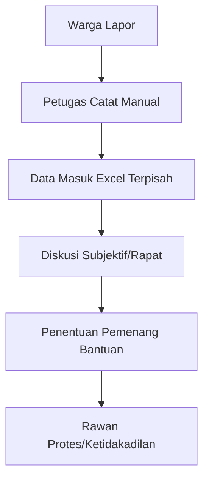
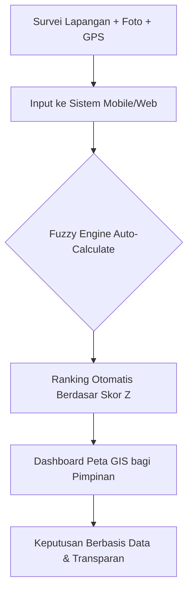

# 🏢 SIMPELAJU: Sistem Informasi Manajemen Pemberian Layanan Plaju
## Sistem Pendukung Keputusan (SPK) Penentuan Kelayakan Bantuan RTLH
**Metode: Fuzzy Mamdani & Web-GIS**

---

## 1. Konsep Dasar Sistem
**SIMPELAJU** adalah platform digital inovatif yang menggabungkan teknologi **Geographic Information System (GIS)** dengan kecerdasan buatan (**Fuzzy Logic**) untuk membantu Pemerintah Kecamatan Plaju dalam menyeleksi penerima bantuan Rumah Tidak Layak Huni (RTLH) secara tepat sasaran, objektif, dan transparan.

Sistem ini bukan sekadar pendataan, melainkan sebuah **Decision Support System (DSS)** yang mampu mengubah data teknis lapangan menjadi keputusan administratif yang kuat.

---

## 2. Rumusan Masalah
Mengapa sistem ini diperlukan?
1.  **Subjektivitas Tinggi**: Penilaian kelayakan rumah seringkali bergantung pada persepsi petugas di lapangan (pilih kasih).
2.  **Fragmentasi Data**: Data calon penerima tersebar di berbagai file Excel manual yang tidak sinkron.
3.  **Kesulitan Prioritas**: Sulit menentukan siapa yang "paling butuh" di antara ribuan pendaftar jika hanya melihat angka mentah.
4.  **Buta Spasial**: Pimpinan sulit melihat sebaran kemiskinan secara geografis untuk menentukan kebijakan wilayah.

---

## 3. Tujuan & Harapan (Expected Outcomes)
### Tujuan:
*   Membangun sistem penilaian yang **otomatis dan standar** berdasarkan regulasi (PUPR No 7 / 2022).
*   Menghasilkan **pemeringkatan (ranking)** calon penerima bantuan yang adil.
*   Menyediakan **peta interaktif** untuk pemantauan sebaran RTLH.

### Apa yang Diharapkan?
*   **Adil & Transparan**: Setiap warga memiliki kesempatan yang sama berdasarkan kondisi riil rumah mereka.
*   **Efisiensi Waktu**: Proses verifikasi dan perangkingan yang biasanya memakan waktu berminggu-minggu kini selesai dalam hitungan detik.
*   **Akurasi Data**: Meminimalisir kesalahan manusia (*human error*) dalam input dan kalkulasi.

---

## 4. Variabel Penilaian (4 Pilar Utama PUPR)
Berdasarkan dokumen teknis (`LA.pdf` & `RTLH Fuzzy.docx`), sistem menggunakan 4 pilar utama dengan variabel spesifik:

### A. Pilar Keselamatan Bangunan (Safety)
Mengukur kekuatan struktur utama agar rumah tidak roboh.
*   **V1: Pondasi** (Ada / Tidak Ada)
*   **V2: Kolom & Balok** (Kondisi beton/kayu penyangga)
*   **V3: Konstruksi Atap** (Kekuatan rangka atap)
*   **Logika**: Rata-rata (V1+V2+V3)/3. Skala 0.0 (Buruk) - 1.0 (Baik).
*   **Fuzzy Set**: Buruk `[0, 0, 0.15, 0.35]`, Sedang `[0.2, 0.5, 0.8]`, Baik `[0.65, 0.85, 1, 1]`.

### B. Pilar Kesehatan Penghuni (Health)
Mengukur kualitas sanitasi dan sirkulasi udara.
*   **V4: Jendela/Lubang Cahaya** (Pencahayaan alami)
*   **V5: Ventilasi** (Sirkulasi udara)
*   **V6: Kamar Mandi & Jamban** (Kepemilikan MCK)
*   **V7: Jarak Sumber Air** (Jarak aman > 10m dari septic tank)
*   **Logika**: Rata-rata (V4+V5+V6+V7)/4. Skala 0.0 (Tidak Sehat) - 1.0 (Sehat).
*   **Fuzzy Set**: Tidak Sehat `[0, 0, 0.15, 0.35]`, Cukup `[0.2, 0.5, 0.8]`, Sehat `[0.65, 0.85, 1, 1]`.

### C. Pilar Luas & Kepadatan (Density)
Mengukur kelayakan ruang gerak manusia.
*   **V8: Luas Bangunan per Orang** (m²/jiwa).
*   **Logika**: Nilai real luas/jumlah penghuni.
*   **Fuzzy Set**: Padat `< 7 m²` `[0, 0, 5, 9]`, Sedang `7-12 m²` `[5, 9.5, 14]`, Layak `> 12 m²` `[10, 14, 30, 30]`.

### D. Pilar Komponen Bangunan (Material)
Mengukur kualitas fisik penutup rumah.
*   **V9: Material Atap**, **V10: Material Dinding**, **V11: Material Lantai**.
*   **Logika**: Sub-inferensi Fuzzy (Material vs Kondisi).

---

## 5. Metodologi: Fuzzy Mamdani
Sistem menggunakan Logika Fuzzy Mamdani dengan 3 tahapan utama:

### Langkah 1: Fuzzifikasi (Input & Sub-Inferensi)
*   **A, B, C**: Skor teknis (0-1) dikonversi menjadi derajat keanggotaan (Buruk, Sedang, Baik).
*   **Sub-Inferensi Aspek D**: Khusus Pilar D, sistem melakukan inferensi awal:
    *   **Material x Kondisi $\rightarrow$ Kualitas Komponen** (9 Aturan DR1-DR9).
    *   **Atap x Lantai x Dinding $\rightarrow$ Skor D** (27 Aturan KR1-KR27).

### Langkah 2: Evaluasi Rule Base Utama (Inference)
Sistem memproses 4 pilar utama menggunakan **37 Aturan Utama (Tabel 3.9)** dengan operator **AND (Min)**.
*   *Contoh R1*: IF A=Buruk AND B=Tidak Sehat AND C=Padat AND D=Buruk THEN LAYAK.
*   *Contoh R23*: IF A=Baik AND B=Sehat AND C=Layak AND D=Baik THEN TIDAK LAYAK.
*   **Komposisi**: Menggunakan fungsi **MAX** untuk menggabungkan hasil seluruh aturan yang aktif.

### Langkah 3: Defuzzifikasi (Centroid / COA)
Mengubah grafik fuzzy hasil komposisi menjadi angka pasti (Skor 0-100).
*   **Formula**: $z^* = \frac{\sum z_i \cdot \mu(z_i)}{\sum \mu(z_i)}$
*   **Threshold**: 
    *   **0 – 50**: TIDAK LAYAK (Tidak direkomendasikan).
    *   **51 – 100**: LAYAK (Direkomendasikan menerima bantuan).

### B. Rumus Defuzzifikasi (Centroid)
Untuk menentukan skor akhir ($Z^*$), sistem menggunakan titik pusat area:

$$Z^* = \frac{\int z \cdot \mu(z) \, dz}{\int \mu(z) \, dz}$$

*Dalam bahasa sederhana: (Jumlah dari Nilai $\times$ Bobot) dibagi (Total Bobot).*

---

## 6. Perbandingan Workflow (Alur Kerja)

### 🔴 Workflow Lama (Manual)

### 🟢 Workflow Baru (Simpelaju)

### Tabel Perbandingan
| Fitur | Sistem Lama (Manual) | SIMPELAJU (Fuzzy + GIS) |
| :--- | :--- | :--- |
| **Objektivitas** | Rendah (Banyak intervensi) | Tinggi (Hitungan Matematika) |
| **Kecepatan** | Berhari-hari (Rekap Excel) | Detik (Otomatis) |
| **Visualisasi** | Tidak ada | Peta Digital (Spatial View) |
| **Arsip** | Berkas fisik (Rawan hilang) | Cloud Database (Aman & Terpusat) |
| **Prioritas** | Kira-kira | Berdasarkan Rangking Skor Terakurat |

---

## 7. Perhitungan Lain-Lain
Sistem juga melakukan kalkulasi tambahan:
*   **GIS Geofencing**: Memastikan koordinat berada di wilayah Plaju.
*   **Kepadatan Hunian**: Rumus: $L_p = \frac{\text{Luas Bangunan}}{\text{Jumlah Penghuni}}$.
*   **Konversi Skor Kualitatif**: Mengubah pilihan "Buruk/Rusak Berat" menjadi nilai $0$ dan "Baik/Kokoh" menjadi $1$ (Skala 0.0 - 1.0).

---
**Simpelaju: Membantu Plaju melaju dengan data yang jujur.**
